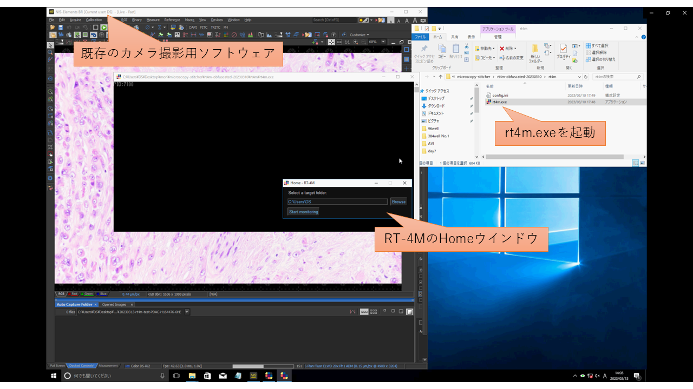
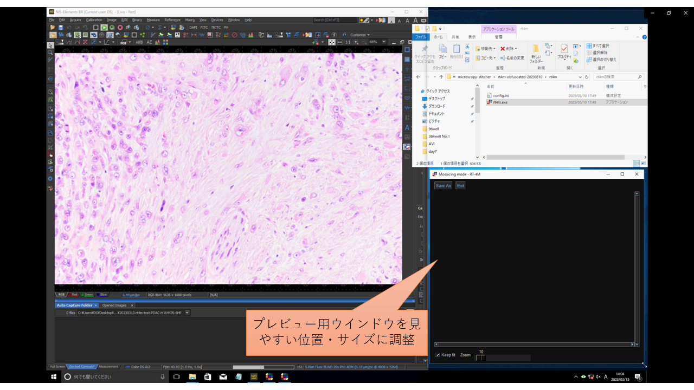
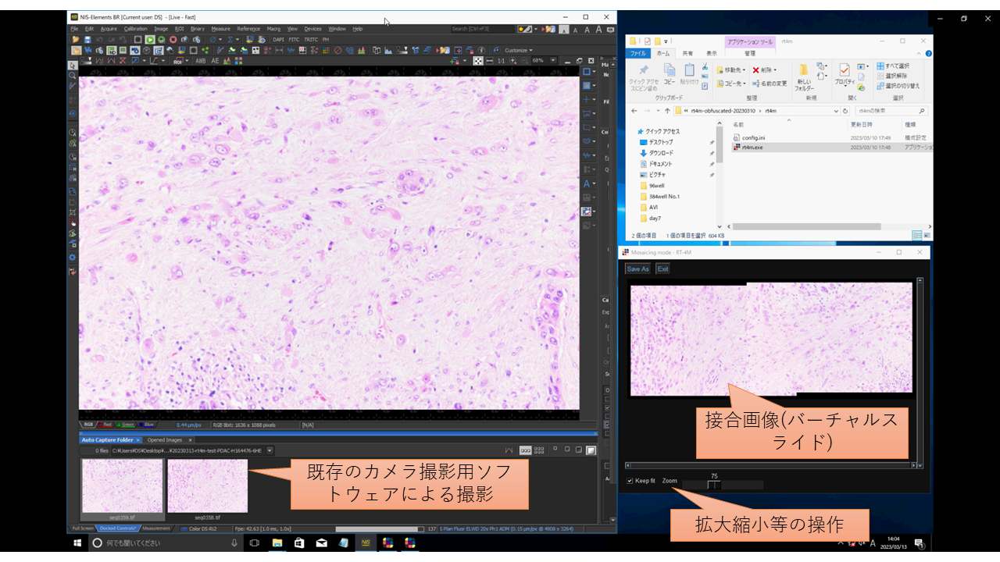

[English](README.md)
# RT-4M: Realtime Mosaicing Manager for Manual Microscopy
## 本ソフトウェアについて
RT-4Mはバーチャルスライドを作製するためのソフトウェアで、以下の特長があります。
- 既存の手動顕微鏡システム（手動ステージの顕微鏡、カメラ、PC）にインストールするだけで利用可能
  - 専用カメラも、電動顕微鏡やスライドスキャナも不要
- 顕微鏡で観察・撮影しながらリアルタイムにバーチャルスライドを作製可能
- 歪み自動補正などの高度な補正機能

本ソフトウェアの使用にあたってはライセンスファイル(LICENSE)を参照してください。本ソフトウェアを使用した場合、ライセンスに同意したものとみなします。

論文等で本ソフトウェアを使用した場合、本ソフトウェアに関する論文を引用してください。以下に文献情報を示します。
```
現在査読中のためプレプリントを記載してあります。将来的にピアレビュー済みの論文情報に差し替えます。
```

ソフトウェアに関するご意見・ご質問・ご要望、コラボレーション・社会実装・ビジネス展開のご提案等、歓迎いたします。

連絡先：

産業技術総合研究所 森宣仁

n-mori@aist.go.jp


## インストール
1. 顕微鏡のカメラ撮影用PCにrt4m-xx.zip (xxは不定) をダウンロードまたはコピーする。
   - zipファイルは以下からダウンロード：[Releases](https://github.com/mori-nobuhito/rt4m-pub/releases)
2. 上記のzipファイルを任意のフォルダに展開する。
   - マルチバイト文字（日本語等）のないフォルダへ展開する。
   - レジストリなどは使用していないため、インストールは以上で完了。アンインストールは展開したフォルダを削除する。

## 使用方法
1. カメラ撮影用ソフトウェア(Olympus CellSens, Nikon NIS-Elementsなど)を起動する。
   - 撮影画像を自動で保存する機能(Auto capture)を使用することを推奨する。設定方法は各ソフトウェアのマニュアルを参照。例として、Nikon NIS-Elementsでは、[Ctrl]-[Space]で撮影と指定フォルダへの保存を行える。
2. RT-4M (rt4m.exe) を起動する。
   
3. [Browse]ボタンを押下し、1のカメラ撮影用ソフトウェアの画像保存フォルダ（以下監視フォルダ）を開く。
   - マルチバイト文字（日本語等）を含むパスはサポート対象外。画像の読み込みに失敗する。
4. [Start monitoring]ボタンを押下する。
   - 監視フォルダに画像ファイルが存在する場合には、それらの画像をバーチャルスライド作製に使用するか確認される。
   - 撮影時に見やすいようにプレビュー画面を適宜サイズ調整して配置する。
   
5. カメラ撮影用ソフトウェアを使用して撮影を行う。RT-4Mが自動で画像を検出して接合していくので、それを見ながら観察位置を変えて撮影を繰り返す。
   - 直前の撮影画像と30%程度重なるように撮影をする。画像の特徴次第で接合に必要な重なりは変わるが、30%程度重ねておけばほぼ接合は成功する。
   - 撮影漏れを見つけたときなど、他の場所から撮影を再開したい場合、直前の撮影画像と重ならなくてもよい。この場合、それまでに撮影済みの画像と重なるように撮影する。
   - [Keep fit]にチェックを入れると、プレビュー画面の大きさに合わせて接合画像(バーチャルスライド)の表示が拡大縮小される。
   - [Zoom]スライダーを動かすことで、手動で拡大縮小できる。
   
6. 撮影を終えたら[Save As]ボタンで接合画像(バーチャルスライド)を保存する。画像のサイズやPCのスペックによって、数分～数十分かかることがある。
7. XボタンでRT-4Mを終了する。
