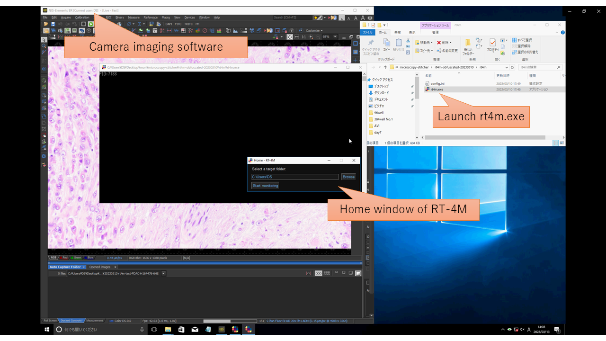
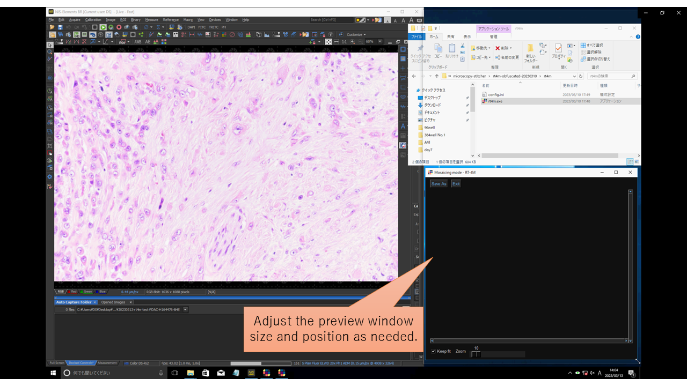
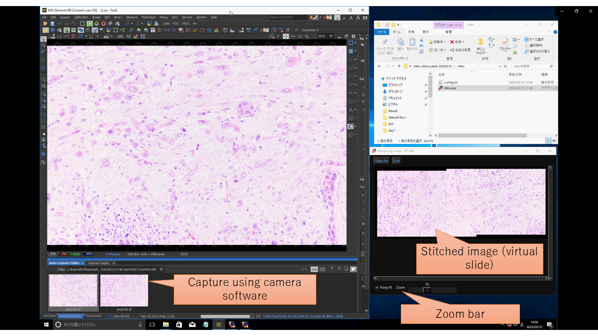

[日本語](README-ja.md)
# RT-4M: Realtime Mosaicing Manager for Manual Microscopy  
## About This Software  
RT-4M is software for creating virtual slides with the following features:  
- Usable simply by installing it on an existing manual microscope system (manual stage microscope, camera, PC) 
  - No need for a dedicated camera, motorized microscope, or slide scanner  
- Enables real-time virtual slide creation while observing and capturing images through a microscope  
- Advanced correction features, including automatic distortion correction  

Please refer to the LICENSE file for the software license. By using this software, you are considered to have agreed to the license.  

If you use this software in a research paper, please cite the related publication. The reference information is provided below:  
```
Currently under peer review, so we have listed the preprint. We will update it with the peer-reviewed version in the future.
```

We welcome feedback, questions, requests, and proposals for collaboration, practical applications, or business development.  

**Contact:**  

National Institute of Advanced Industrial Science and Technology  
Nobuhito Mori  

n-mori@aist.go.jp  

## Installation  
1. Download or copy `rt4m-xx.zip` (where `xx` is a variable) to the PC used for camera imaging with the microscope.  
   - zip package can be found at [Releases](https://github.com/mori-nobuhito/rt4m-pub/releases)
2. Extract the zip file to a folder of your choice.  
   - Extract it to a folder without multibyte characters (e.g., Japanese characters).  
   - Since the software does not use the registry, installation is complete at this point. To uninstall, simply delete the extracted folder.  

## Usage  
1. Launch the camera imaging software (such as Olympus CellSens or Nikon NIS-Elements).  
   - It is recommended to use the auto capture feature that automatically saves captured images. Refer to the software manuals for settings.  
   - For example, in Nikon NIS-Elements, pressing `[Ctrl] + [Space]` will capture an image and save it to the specified folder.  
2. Start RT-4M (`rt4m.exe`).  
   
3. Click the `[Browse]` button and open the image save folder (hereafter referred to as the monitoring folder) of the camera imaging software from step 1.  
   - Paths containing multibyte characters (such as Japanese) are not supported. Image loading may fail.  
4. Click the `[Start monitoring]` button.  
   - If there are existing image files in the monitoring folder, you will be asked whether to use them for virtual slide creation.  
   - Adjust and position the preview window size as needed for better visibility while capturing images.  
   
5. Capture images using the camera imaging software. RT-4M will automatically detect and stitch the images, allowing you to move the observation position and continue capturing.  
   - Ensure that each captured image overlaps about 30% with the previous one. The required overlap may vary depending on image features, but a 30% overlap generally ensures successful stitching.  
   - If you find missing areas or need to restart imaging from another location, images do not need to overlap with the last captured image. Instead, make sure new images overlap with previously captured ones.  
   - Checking `[Keep fit]` will adjust the display size of the stitched image (virtual slide) to fit the preview window.  
   - You can manually zoom in and out using the `[Zoom]` slider. 
   
6. Once imaging is complete, save the stitched image (virtual slide) using the `[Save As]` button. Depending on image size and PC specifications, saving may take several minutes to tens of minutes.  
7. Click the `[X]` button to close RT-4M.  
